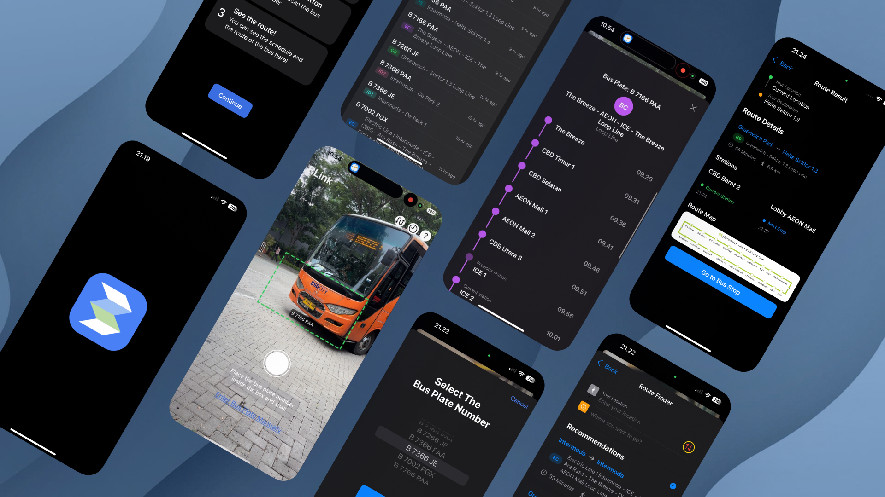

# BLink 🚌




BLink is a mobile application designed to help users scan bus plate numbers and instantly access route information, schedules, and navigation assistance for the BSD City bus network. It provides a seamless way to navigate public transportation with real-time information.

This project is part of Apple Developer Academy @BINUS - Cohort 8
Created by Team #32 - BLink
Collaborated by

- Victor Chandra
- Reynaldo
- Widy

> Special thanks for all the mentors and mentees that helping us achieving this, specially to Kak Luqman.

---

## Tech Stack


1. **Swift** as the programming language
2. **SwiftUI** for the user interface
3. **SwiftData** for local data persistence
4. **Vision Framework** for plate number recognition
5. **CoreLocation** for location data and maps integration

---

## Table of Contents

1. [Installation](#installation)
2. [Features](#features)
3. [Usage](#usage)
4. [App Structure](#app-structure)
5. [Contributors](#contributors)

---

## Installation

### Prerequisites

- Xcode 15.0 or later
- iOS 17.0 or later
- macOS Ventura or later (for development)
- Active Apple Developer account (for deployment)

### Steps

1. **Clone Repository:**

```bash
git clone https://github.com/reynaldomarchell/BLink.git
```

2. **Open Project in Xcode:**

```shellscript
cd blink
open BLink.xcodeproj
```

3. **Install Dependencies:**

The project uses Swift Package Manager for dependencies. Xcode should automatically resolve them when opening the project.

4. **Build and Run:**

Select your target device or simulator and press ⌘+R to build and run the application.

5. **Camera Permissions:**

The app requires camera permissions to scan bus plate numbers. Make sure to grant these permissions when prompted.

---

## Features

- **Plate Number Scanning:** Scan bus plate numbers using your device's camera
- **Route Information:** View detailed route information including stations and schedules
- **Route Finder:** Search for routes by destination or starting point
- **Route History:** Access previously scanned buses and routes
- **Route Maps:** View route maps and get directions to bus stops
- **Dark Mode Support:** Fully compatible with iOS dark mode
- **Offline Access:** Access previously scanned routes even without internet connection
- **Manual Input:** Manually enter plate numbers when scanning is difficult

---

## Usage

1. **Home Screen:** Point your camera at a bus plate number and tap the capture button
2. **Scan Result:** View the route information for the scanned bus
3. **Route Finder:** Search for routes by destination or starting point
4. **Route History:** Access your previously scanned buses
5. **Route Details:** View detailed information about stations, schedules, and maps

---

## App Structure

```plaintext
BLink/
├── Models/
│   ├── BusInfo.swift               # Bus information model
│   └── BusRoute.swift              # Route information model
├── Views/
│   ├── HomeView.swift              # Main camera view
│   ├── ManualPlateInputView.swift  # Select plate display
│   ├── ScanResultView.swift        # Scan results display
│   ├── RouteFinderView.swift       # Route search functionality
│   ├── RouteResultView.swift       # Route details display
│   ├── RouteHistoryView.swift      # History of scanned buses
│   └── TutorialView.swift          # Tutorial display
├── Utils/
│   ├── DataSeeder.swift            # Initial data population
│   └── CoreLocation.swift          # Location services
└── BLinkApp.swift                  # App entry point
```

---

## Contributors

<a href="https://github.com/reynaldomarchell/blink/graphs/contributors">
    
</a>

---

## Buy us a coffee!

Whether you use this project, have learned something from it, or just like it, please consider supporting it by buying me a coffee, so I can dedicate more time on open-source projects like this :)

<a href="https://www.buymeacoffee.com/mzmznasipadang" target="_blank"></a>

---

## License

This project is licensed under the MIT License - see the LICENSE file for details.

---

## Acknowledgments

- BSD City/Sinarmas Transportation Department for route information
- Apple Developer Documentation for Vision framework guidance
- SwiftUI and SwiftData community for resources and examples
- Our mentors and teams that always support us ❤️
